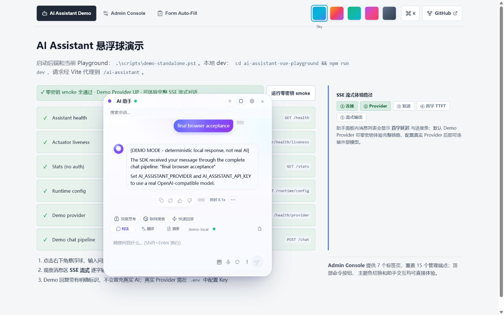

# AI Assistant SDK

面向 Java 21 / Spring Boot 3 与 Vue 3 的可嵌入 AI 助手 SDK。仓库同时提供 Spring Boot Starter、独立服务、Java Client、Vue 组件、Web Component、Playground 和部署模板。

[](./LICENSE)
[](https://openjdk.org/)
[](https://spring.io/projects/spring-boot)
[](https://vuejs.org/)
[](https://github.com/Hou-mingyuan/ai-assistant-sdk/actions)

[English](./README_EN.md) · [快速开始](docs/guide/quick-start.md) · [能力矩阵](docs/CAPABILITY-MATRIX.md) · [API](docs/api/index.md) · [部署](DEPLOYMENT.md) · [安全](SECURITY.md) · [性能](PERFORMANCE.md)

<p align="center">
  
</p>

> 当前版本是 `1.0.1` 发布候选版，不是“无需评估即可生产上线”的承诺。核心 REST/SSE、Starter、独立服务、Java Client、Vue 和 Web Component 为稳定范围；RAG、Agent、MCP、WebSocket、Admin 和 Artifact 的具体边界见[能力矩阵](docs/CAPABILITY-MATRIX.md)。

## 先选接入路径

| 路径 | 适用场景 | 最短入口 |
| --- | --- | --- |
| Spring Boot Starter | 复用宿主认证、租户与业务 Bean | `ai-assistant-demo` 示例，或在现有应用引入 Starter |
| 独立服务 | 多个前端共享一个 AI 网关，或不修改业务后端 | `copy .env.example .env` 后运行 `docker compose up -d --build` |

两条路径使用同一 REST/SSE 契约。一个前端实例不要同时混用两套后端地址。

## 零密钥一键启动

要求：Docker Engine/Desktop + Compose v2；执行自动验收还需要 Node.js 22。默认无需账号，也无需外部模型 Key。

支持 Windows 11、Linux 和 macOS；主机至少需要 2 个 CPU、4 GB 可用内存和 6 GB 可用磁盘。

Windows：

```bat
copy .env.example .env
docker compose up -d --build
node scripts\smoke-zero-key.mjs http://localhost:8080/ai-assistant
```

Linux / macOS：

```bash
cp .env.example .env
docker compose up -d --build
node scripts/smoke-zero-key.mjs http://localhost:8080/ai-assistant
```

`.env.example` 默认选择确定性的 `demo` Provider。它会走完整 HTTP/SSE 链路，但不访问外部模型：

- Provider 健康状态为 `UP`，同时返回 `mode=demo`、`mock=true`。
- `/chat` 和 `/stream` 返回明确的 Demo 标识，响应元数据包含 `provider=demo`。
- Demo 输出只用于零密钥演示和回归测试，不能当作真实 AI 效果。

启动后：

```text
GET  http://localhost:8080/ai-assistant/health
POST http://localhost:8080/ai-assistant/chat
POST http://localhost:8080/ai-assistant/stream
GET  http://localhost:8080/actuator/health/liveness
```

停止服务：

```bash
docker compose down
```

## Playground

Playground 将独立服务、Vue 组件和真实 SSE 请求串成一条演示链路：

```powershell
# Windows
.\scripts\demo-standalone.ps1
```

```bash
# Linux / macOS
./scripts/demo-standalone.sh
```

打开 `http://localhost:3000/`。页面会显示当前是 Demo 还是真实 Provider，并提供对话、Admin 状态和表单填充演示。完整步骤见[演示指南](docs/DEMO.md)。

## Starter 集成

环境要求：JDK 21、Maven 3.9+、Node.js 22。仓库内的 `ai-assistant-demo` 是可运行宿主示例，默认同样使用 Demo Provider。一键脚本会从 lockfile 安装前端依赖、构建真实 Web Component、打包并启动宿主：

```powershell
# Windows
.\scripts\demo-starter.ps1
```

```bash
# Linux / macOS
bash scripts/demo-starter.sh
```

手动等价命令：

```bash
npm --prefix ai-assistant-ui ci
npm --prefix ai-assistant-ui run build:publish
mvn -pl ai-assistant-demo -am -DskipTests package
java -jar ai-assistant-demo/target/ai-assistant-demo-1.0.1.jar
```

打开 `http://localhost:8080/`，或运行 Demo 的真实 HTTP 集成测试：

```bash
mvn -pl ai-assistant-demo -am test
```

在自己的 Spring Boot 3 应用中接入：

```xml
<dependency>
  <groupId>com.aiassistant</groupId>
  <artifactId>ai-assistant-spring-boot-starter</artifactId>
  <version>1.0.1</version>
</dependency>
```

零密钥开发配置：

```yaml
ai-assistant:
  provider: demo
  context-path: /ai-assistant
```

真实模型配置：

```yaml
ai-assistant:
  provider: openai
  base-url: ${AI_ASSISTANT_BASE_URL:https://api.openai.com/v1}
  api-key: ${AI_ASSISTANT_API_KEY}
  model: ${AI_ASSISTANT_MODEL:gpt-4o-mini}
  access-token: ${AI_ASSISTANT_ACCESS_TOKEN}
  allowed-origins: ${AI_ASSISTANT_ALLOWED_ORIGINS}
```

真实 Provider 不可达、鉴权失败或返回限流时，SDK 会返回可诊断错误，不会回退为 Demo 成功响应。供应商配置和默认模型见[配置说明](docs/guide/configuration.md)。

## Vue 3 与 Web Component

Vue 3：

```bash
npm install @ai-assistant/vue
```

```ts
import AiAssistant from '@ai-assistant/vue'
import '@ai-assistant/vue/dist/style.css'

app.use(AiAssistant, {
  baseUrl: '/ai-assistant',
  accessToken: '由宿主安全注入的短期令牌',
  tenantId: 'tenant-a',
  locale: 'zh',
  theme: 'auto',
})
```

模板中放置 `<AiAssistant />`，或配置 `autoMountToBody: true`。

Web Component：

```ts
import '@ai-assistant/vue/wc'
import '@ai-assistant/vue/dist/style.css'
```

```html
<ai-assistant
  base-url="/ai-assistant"
  tenant-id="tenant-a"
  locale="zh"
></ai-assistant>
```

Web Component 复用同一后端、认证头、租户头和 SSE 契约。完整配方见[前端集成文档](docs/guide/frontend-recipes.md)。

## 稳定能力

- 同步聊天、翻译、摘要与 SSE 流式响应。
- 统一结构化错误、request id、超时、取消和重试反馈。
- `X-AI-Token`、`X-Tenant-Id`、CORS、SSRF、上传限制、PII 遮罩、注入告警和限流基线。
- Java Client、Vue 插件、Composable 与 `<ai-assistant>` Web Component。
- 多轮 Function Calling 执行循环；业务工具 Schema、权限和副作用控制由宿主负责。
- 健康、存活、就绪、运行时配置摘要、可选指标与 tracing 支持。

以下能力不是 v1 稳定承诺：本地内存 RAG、调用方计划驱动的 Agent、MCP JSON-RPC 子集、WebSocket、Admin 与 Artifact 预览。仓库不包含 Milvus/Pinecone/Qdrant 实现，也没有自主 LLM ReAct 规划器。

## 安全边界

Demo 默认允许本地零密钥体验；对外部署前至少配置：

```text
AI_ASSISTANT_PROVIDER=<真实 provider>
AI_ASSISTANT_API_KEY=<密钥管理系统注入>
AI_ASSISTANT_ACCESS_TOKEN=<高强度随机值>
AI_ASSISTANT_ALLOWED_ORIGINS=https://your-frontend.example
AI_ASSISTANT_ALLOW_QUERY_TOKEN_AUTH=false
```

Admin、MCP、连接器管理、Headless 抓取和 RAG 默认关闭。`X-Tenant-Id` 只建立请求级租户上下文，不能代替宿主的登录、RBAC 和资源所有权检查。上线前逐项执行[生产检查清单](docs/guide/production-checklist.md)。

## 模块

| 模块 | 作用 |
| --- | --- |
| `ai-assistant-server` | Spring Boot Starter 与核心服务 |
| `ai-assistant-service` | 独立运行的 Spring Boot 服务与 Docker 镜像 |
| `ai-assistant-client` | Java Client |
| `ai-assistant-ui` | `@ai-assistant/vue`、Composable 与 Web Component |
| `ai-assistant-vue-playground` | Demo / Admin / Form Fill Playground |
| `ai-assistant-demo` | 最小 Starter 宿主与真实 HTTP 集成测试 |
| `ai-assistant-observability-support` | 可选 OpenAPI、Tracing 与日志桥接 |
| `e2e` | Playwright 浏览器验收 |
| `docs` | VitePress 文档站 |

### Observability support

`ai-assistant-observability-support` 是可选支持包：OpenAPI 可作为 direct dependency 接入；Tracing 和 JSON logging 都是 optional 桥接，不会由基础 Starter 自动引入。Starter-only 与支持包接入方式见[可观测性快速开始](docs/guide/observability-support-quick-start.md)。

## 开发验证

推荐环境：Windows 11、Linux 或 macOS；JDK 21；Maven 3.9+；Node.js 22 + npm；需要容器验证时使用 Docker Compose v2。首次安装需要访问 Maven/npm 镜像。

```bash
# 后端全部模块
mvn test

# Java Client 发布前验证
mvn -f ai-assistant-client/pom.xml verify

# Vue：lint、格式、测试与发布构建
cd ai-assistant-ui
npm ci
npm run lint
npm run format:check
npm test
npm run build:publish

# Playground
cd ../ai-assistant-vue-playground
npm ci
npm test
npm run build

# 文档
cd ../docs
npm ci
npm run build

# 浏览器 E2E
cd ../e2e
npm ci
npx playwright install chromium
npm test
```

更多入口：

- [快速开始](docs/guide/quick-start.md)
- [能力矩阵](docs/CAPABILITY-MATRIX.md)
- [API 文档](docs/api/index.md)
- [部署与运维](DEPLOYMENT.md)
- [安全策略](SECURITY.md)
- [性能与容量](PERFORMANCE.md)
- [故障排查](docs/guide/troubleshooting.md)
- [CHANGELOG](CHANGELOG.md)

## License

[MIT](./LICENSE) © [Hou-mingyuan](https://github.com/Hou-mingyuan)
