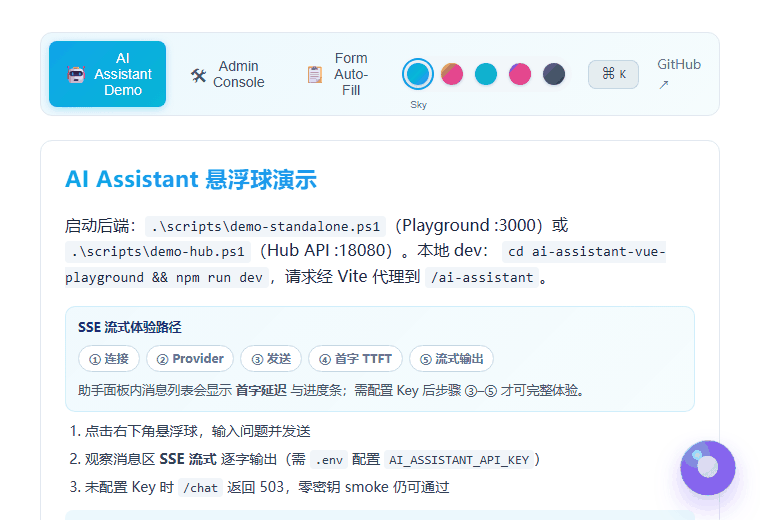

<div align="center">

# 🤖 AI Assistant SDK

### Drop an enterprise-grade AI assistant into any Java + Vue app in 5 minutes

One Spring Boot starter on the backend, one component on the frontend — instantly get **multi-turn chat · translation · summarization · RAG · multi-step agents · function calling · 16 LLM providers**

[](https://github.com/Hou-mingyuan/ai-assistant-sdk/stargazers)
[](https://github.com/Hou-mingyuan/ai-assistant-sdk/network/members)

[](./LICENSE)
[](https://openjdk.org/)
[](https://spring.io/projects/spring-boot)
[](https://vuejs.org/)
[](https://github.com/Hou-mingyuan/ai-assistant-sdk/actions)
[](CONTRIBUTING.md)

[简体中文](./README.md) · [📖 Docs](docs/guide/index.md) · [🚀 Quick Start](docs/guide/quick-start.md) · [💡 Features](docs/guide/index.md) · [🐛 Issues](https://github.com/Hou-mingyuan/ai-assistant-sdk/issues)

<!-- 📌 Record a demo GIF (floating ball → ask → streaming answer → RAG citations), save to docs/assets/demo.gif, then uncomment the line below -->
<!--  -->

_🎬 Demo GIF coming soon_

<br/>

> ⭐ **If this project helps you, drop a Star to help others find it!** Every star keeps this project maintained.

</div>

---

## What is this

**AI Assistant SDK** is an embeddable, enterprise-grade AI assistant for any **Java + Vue** project. It covers one-click translation, full-text summarization, free chat, RAG knowledge base, multi-step agents, PII masking, multi-tenant isolation and an admin dashboard.

The repo ships a Spring Boot Starter, a standalone service, a Vue 3 component library, a Web Component, a Java client, a VitePress docs site and Helm/Docker deployment templates. Pick one or two integration styles — they don't conflict.

## Why AI Assistant SDK

- 🧩 **Ridiculously fast to integrate** — add one starter on the backend, one `app.use` line on the frontend, and you're running in 5 minutes. No need to build your own LLM gateway.
- 🌐 **16 LLM providers out of the box** — OpenAI / DeepSeek / Qwen / Zhipu GLM / Doubao / Kimi / Gemini / Ollama… switch with a single config key, or plug in any OpenAI-compatible endpoint.
- 🏢 **Built for the enterprise** — multi-tenant isolation, PII masking, prompt-injection detection, per-tenant token quota, model routing with A/B testing, rate limiting and circuit breakers. Not a demo — production-ready.
- 🧠 **Beyond chat** — RAG retrieval augmentation, function calling, ReAct multi-step agents and an MCP server, all included.
- 🎨 **Three frontend forms** — Vue plugin / Web Component (`<ai-assistant>`, usable in React, Angular, plain HTML) / `useAiAssistant` composable, with 70+ config options.
- 🛠 **Solid engineering** — CI, OWASP Dependency-Check, Trivy, E2E tests, a Helm chart, multiple docker-compose files and a full docs site.

## Features

**Core interaction**
- Translate / summarize / free-chat modes; multi-turn memory with editable system prompt
- SSE streaming (typewriter effect) and optional WebSocket duplex channel
- Safe Markdown rendering (DOMPurify + highlight.js), dark/light/system themes, i18n UI (zh / en / ja / ko)
- Conversation persistence, multi-session tabs, in-conversation search, conversation forking

**Multi-model**
- OpenAI, DeepSeek, Qwen, Zhipu GLM, Doubao, MiniMax, Kimi, Gemini, SiliconFlow, Groq, Yi, Spark, Baichuan, StepFun, Hunyuan, Ollama built in; any OpenAI-compatible provider via `provider=openai` + custom `base-url`.

**Enterprise**
- Multi-tenant isolation (`X-Tenant-Id` header driven), PII masking + prompt-injection detection
- Per-tenant token usage & daily quota, smart model routing (task/cost/token) + A/B testing
- Server-side prompt template engine (`{{var}}`, `{{#if}}`, 4 presets)

**Engineering & ops**
- Function calling (multi-round tool-calling loop) + ReAct multi-step agent
- RAG (embedding → vector store → context injection), async task API (202 + polling + webhook)
- Admin REST dashboard, data connectors (Informat / JDBC / REST) auto-registered as LLM tools
- Startup provider connectivity check, connector health scheduling, circuit breakers, in-process or Redis rate limiting

**Frontend**
- Vue 3 plugin / Web Component / `useAiAssistant` composable
- Drag-and-drop file upload (PDF / Word / Excel / CSV), vision image understanding, TTS, 🎤 voice input
- Floating ball & panel with 70+ config options

## Quick Start

Full guide: [docs/guide/quick-start.md](docs/guide/quick-start.md).

**Backend (Spring Boot 3.x)**

```xml
<dependency>
  <groupId>com.aiassistant</groupId>
  <artifactId>ai-assistant-spring-boot-starter</artifactId>
  <version>1.0.1</version>
</dependency>
```

```yaml
ai-assistant:
  provider: deepseek
  api-key: sk-xxx
  context-path: /ai-assistant
```

**Frontend (Vue 3)**

```bash
npm install @ai-assistant/vue
```

```ts
import AiAssistant from '@ai-assistant/vue'
import '@ai-assistant/vue/dist/style.css'

app.use(AiAssistant, { baseUrl: '/ai-assistant', theme: 'auto', locale: 'en' })
```

Place `<AiAssistant />` in your template, or enable `autoMountToBody: true`.

## Standalone service (Docker)

```bash
cp .env.example .env   # set AI_ASSISTANT_API_KEY at minimum
docker compose up -d --build
```

Then hit `http://localhost:8080/ai-assistant/health`. For Kubernetes, use the `helm/ai-assistant` chart. See [deployment checklists](docs/guide/deployment-checklists.md).

## Documentation

- [Quick Start](docs/guide/quick-start.md) · [Configuration](docs/guide/configuration.md) · [Deployment](docs/guide/deployment-checklists.md)
- [API Reference](docs/api/index.md) · [Chat API](docs/api/chat.md) · [Admin API](docs/api/admin.md)
- [Function Calling & Agent](docs/guide/function-calling.md) · [Plugins / Data Connectors](docs/guide/plugins.md) · [MCP Server](docs/guide/mcp-server.md)

## Contributing & Support

Issues, PRs and ideas are welcome! Please read [CONTRIBUTING.md](CONTRIBUTING.md) first.

If this project helps you:

- ⭐ **Star** it — the best encouragement for the author and it helps others discover it
- 🍴 **Fork** it and make it your own
- 📢 **Share** it with peers who might need it

[](https://star-history.com/#Hou-mingyuan/ai-assistant-sdk&Date)

## License

[MIT](./LICENSE) © [Hou-mingyuan](https://github.com/Hou-mingyuan)
