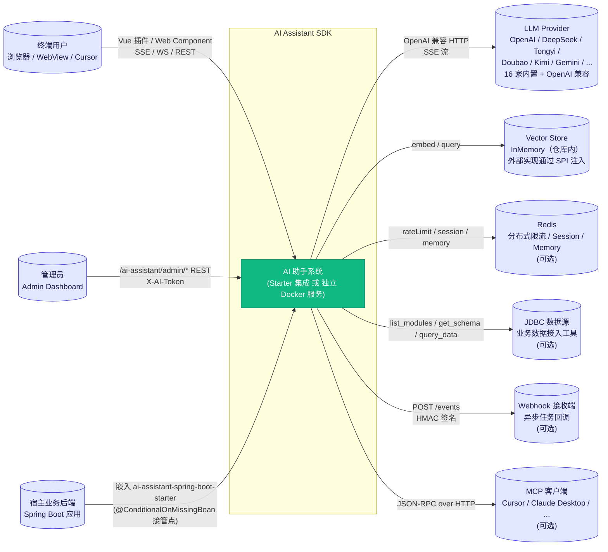
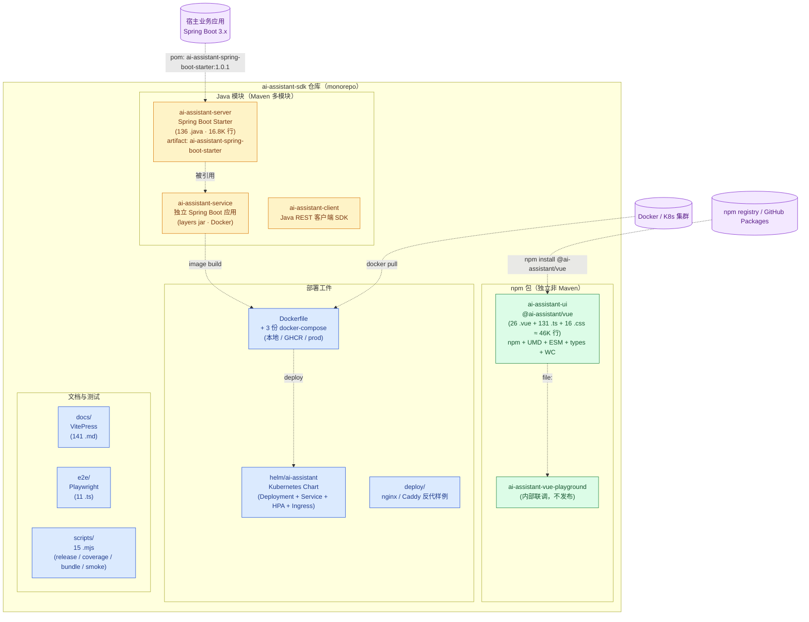
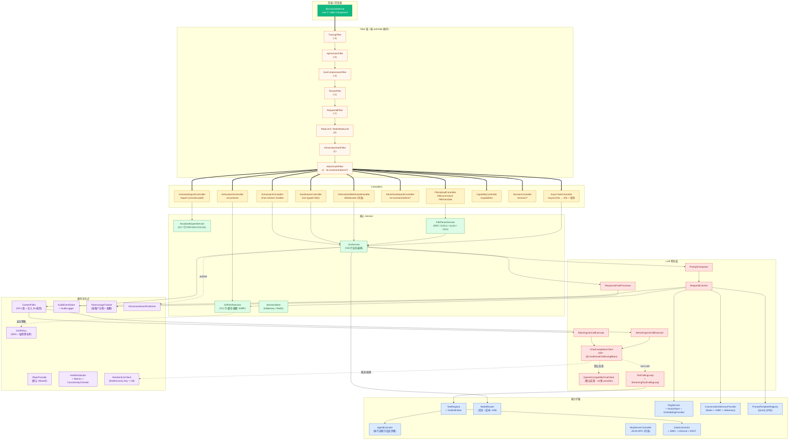
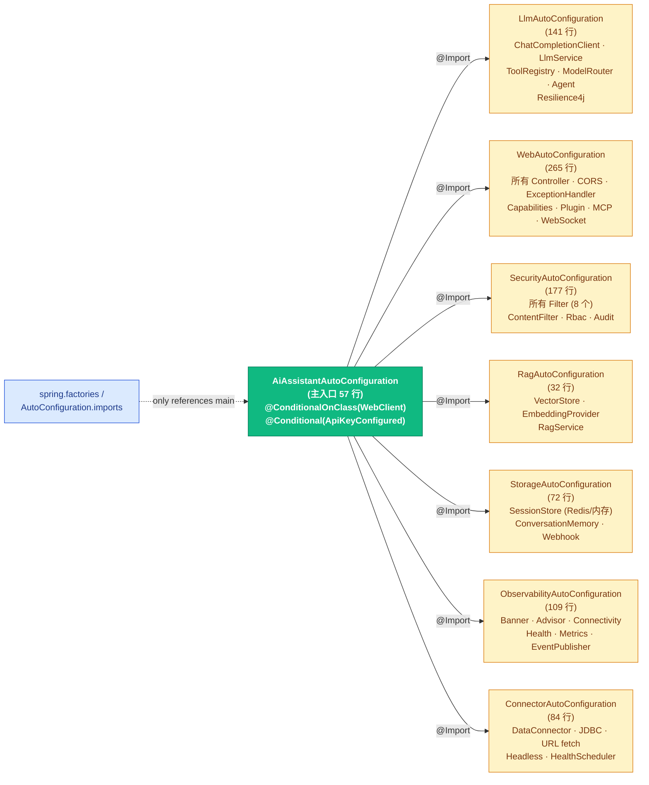

# 架构总览（C4 model）

本文档采用 [C4 model](https://c4model.com/) 的三层视角描述 AI Assistant SDK 的架构：

1. **Level 1 · System Context**：本系统与外部用户、外部服务的关系
2. **Level 2 · Container**：仓库内的进程级运行单元（Java 后端 / Vue 前端 / Docker / K8s / 文档站）
3. **Level 3 · Component**：核心运行单元内的关键组件分布

> 本文档由 T4 任务自动生成，与根目录 `README.md` 的"架构与扩展点"段保持同步。修改时请同步更新两边。

---

## Level 1 · System Context

### 关键边界

| 边界 | 协议 | 安全控制 |
|---|---|---|
| 用户 ↔ AI Assistant | HTTPS REST / SSE / WS | `AccessToken`(X-AI-Token)、CORS allowlist、IP/Token 限流 |
| 管理员 ↔ Admin REST | HTTPS REST | `AdminToken`（可独立 token，fallback access-token） |
| 宿主业务后端 ↔ Starter | 内 JVM 调用 + `ChatCompletionClient` SPI | `@ConditionalOnMissingBean` 接管点；宿主可注入任意 Bean |
| 系统 ↔ LLM | OpenAI 兼容 HTTPS | `apiKey` 多 key 轮询、`ProviderConnectivityChecker` 启动探测 |
| 系统 ↔ 外部 URL（抓取） | HTTPS GET | `UrlFetchService` + `SsrfPolicy`（私网 / loopback / 元数据黑名单）+ Bytes/Time 上限 |
| 系统 ↔ JDBC | JDBC | `allowedTables` 白名单、SQL 注入检测、`schema` 限定 |

---

## Level 2 · Container

### Container 维度对比表

| Container | 形态 | 入口 / 工件 | 何时使用 |
|---|---|---|---|
| `ai-assistant-server` | Maven JAR | `com.aiassistant:ai-assistant-spring-boot-starter:1.0.1` | 嵌入现有 Spring Boot 业务后端 |
| `ai-assistant-service` | 可执行 JAR + Docker | `ai-assistant-service-1.0.1.jar` / Docker 镜像 | 独立部署，不修改业务后端 |
| `ai-assistant-client` | Maven JAR | `com.aiassistant:ai-assistant-client:1.0.1` | 任意 Java 应用通过 REST 调用 SDK |
| `ai-assistant-ui` | npm 包 | `@ai-assistant/vue@1.0.1`（umd/esm/types/wc） | 任意 Vue 3 项目；或非 Vue 项目用 `<ai-assistant>` Web Component |
| `helm/ai-assistant` | Helm Chart | `helm install` | Kubernetes 集群部署 |

---

## Level 3 · Component（Spring Boot Starter 内部）

### Spring Boot 自动装配拓扑

T2 重构后，自动装配按职能拆为 7 个 sibling Configuration，由主入口 `@Import` 聚合：

> 这种 `@Import` 聚合的好处：宿主应用方使用方式不变（spring.factories 仍只列主类），但每个 Configuration 文件 < 280 行，新增/修改 Bean 时仅需改对应 sibling 文件。

---

## Component 维度统计

| 层 | 组件数 | 总行数 | 关键文件 |
|---|---:|---:|---|
| **Controller** | 14 | 1,919 | `AiAssistantController` `SseStreamController` `AdminDashboardController` `BatchController` `AsyncTaskController` |
| **Service** | 22 | 4,773 | `LlmService` (745) `UrlFetchService` (741) `AssistantExportService` (517) `FileParserService` |
| **Config** | 23 | 2,140（T2 后 ~2,000） | `AiAssistantProperties` (513) `AiAssistantAutoConfiguration` (57) + 7 sibling Configuration `ProviderDefaults` |
| **Connector** | 9 | 1,738 | `DataConnector` `JdbcConnector` `ConnectorHealthScheduler` `ConnectorFactory` |
| **Security** | 7 | 659 | `ContentFilter` `DefaultSsrfPolicy` `RbacProvider` `AuditLogger` `LoggingAuditEventStore` |
| **LLM Gateway** | (在 service/llm 下) | ~700 | `ChatCompletionClient` SPI · `OpenAiCompatibleChatClient` · 4 个 Executor/Loop |
| **RAG** | 5 | 318 | `RagService` `VectorStore` `InMemoryVectorStore` `OpenAiEmbeddingProvider` `EmbeddingProvider` |
| **Tool / Agent / Routing** | 1+1+1 | 341 | `ToolRegistry` `AgentExecutor` `ModelRouter` |
| **Memory** | 4 | ~110 | `ConversationMemoryProvider` `InMemoryConversationMemoryProvider` `RedisConversationMemoryProvider` `JdbcConversationMemoryProvider` |
| **Prompt** | 2 | 171 | `PromptTemplateRegistry` `PromptTemplate` |
| **Stats** | 2 | 193 | `UsageStats` `TokenUsageTracker` |
| **Observability** | 2 | 80 | `AiAssistantHealthIndicator` `AiAssistantMetrics` |

---

## 与文档站其它页面的关系

- [`backend-architecture.md`](backend-architecture.md)：本文档的"模块边界与扩展点维护建议"详细版
- [`configuration.md`](configuration.md)：组件对应的配置项分层说明
- [`chat.md`](chat.md) / [`function-calling.md`](function-calling.md)：核心交互流程
- [`plugins.md`](plugins.md)：`DataConnector` 扩展点
- [`mcp-server.md`](mcp-server.md)：MCP Server 组件
