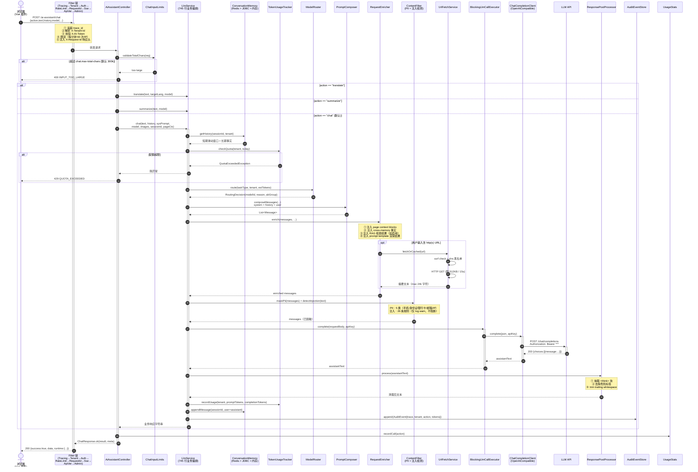
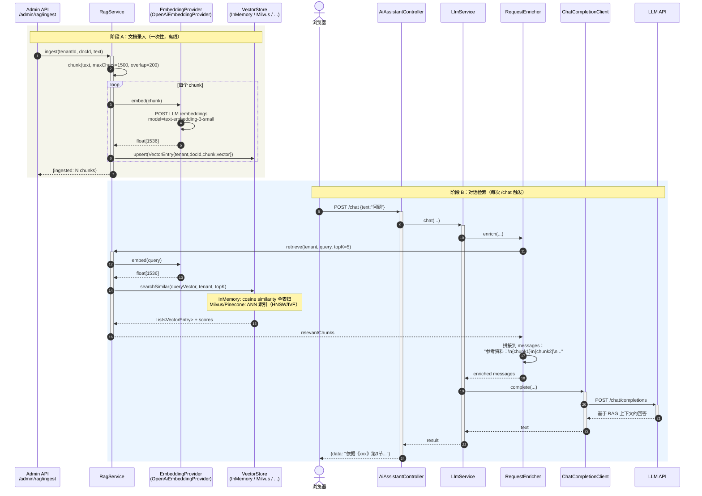
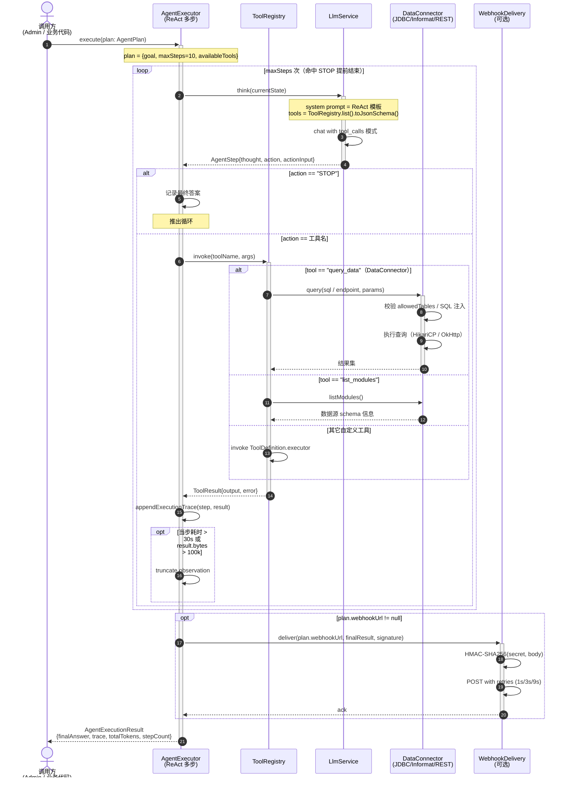

# 调用链路序列图

本页用 Mermaid 序列图描述 AI Assistant SDK 4 条最核心的调用链路：

1. [同步对话 `/chat`](#1-同步对话-chat)
2. [流式输出 `/stream`（SSE）](#2-流式输出-streamsse)
3. [RAG 检索增强](#3-rag-检索增强)
4. [ReAct Agent 多步工具调用](#4-react-agent-多步工具调用)

每条链路都标注了 **请求耗时占比** 与 **可观测点**（Metrics / Audit / Event），便于排障与性能优化。

> 本文档由 T6 任务产出，与 [`architecture.md`](architecture.md) 的 Component 图配合阅读。

---

## 1. 同步对话 `/chat`

最常用入口：单轮 LLM 调用，返回完整响应字符串。



**可观测点**：
- **Trace**：步骤 ① 起 `trace_id` 贯穿全链路（Micrometer Tracing + OTLP）
- **Metrics**：`ai_assistant.chat.count`、`ai_assistant.chat.latency`、`ai_assistant.tokens.used{tenant}`（步骤 ⑮、⑯）
- **Audit**：步骤 ⑯ 写 AuditEvent（trace、tenant、action、token 用量、模型）
- **Event Bus**：成功完成时 `AiAssistantEventPublisher.publish(ChatCompletedEvent)`

**典型耗时**（单次 LLM 调用 ~3s 量级）：
- Filter 链：< 5ms
- Compose + Enrich + URL fetch（如有）：5-100ms
- ContentFilter：< 2ms
- LLM call：**1.5-5s（≥ 95% 占比）**
- Post + Quota + Memory + Audit：< 10ms

---

## 2. 流式输出 `/stream`（SSE）

打字机效果：LLM 边生成边推到浏览器。

```mermaid
sequenceDiagram
    autonumber
    actor User as 浏览器<br/>(EventSource)
    participant SseFilter as SseCompressionFilter
    participant Filter as Filter 链<br/>(其它)
    participant Ctrl as SseStreamController
    participant Llm as LlmService
    participant Stream as StreamingLlmCallExecutor
    participant Loop as StreamingToolCallingLoop
    participant Client as ChatCompletionClient
    participant LLM as LLM API
    participant Compress as Gzip stream

    User->>+SseFilter: POST /ai-assistant/stream<br/>Accept: text/event-stream
    SseFilter->>Filter: passthrough
    Filter->>+Ctrl: 转发请求
    Ctrl->>+Llm: streamChat(...)

    Llm->>Llm: 同 /chat 的 enrich + filter（步骤略）

    Llm->>+Stream: completeStream(requestBody, apiKey)
    Stream->>+Client: completeStream(json, apiKey)
    Client->>+LLM: POST /chat/completions<br/>{...,"stream":true}

    loop 每收到一个 data: {...} chunk
        LLM-->>Client: data: {choices:[{delta:{content:"片段"}}]}
        Client-->>Stream: emit content delta
        Stream-->>Llm: Flux<String> delta

        opt 检测到 tool_calls 块
            Llm->>Loop: handleToolCalls(call)
            Loop->>Loop: invoke ToolDefinition
            Loop-->>Llm: tool result
            Llm->>+Client: completeStream(updatedRequest)
            Note over Client,LLM: 重新发起新的 LLM 请求<br/>带 tool result 拼接的 messages
        end

        Llm-->>Ctrl: SSE event
        Ctrl->>Compress: 写入 gzip 包装的 EventStreamWriter
        Compress-->>User: data: {"content":"片段"}\n\n
        Note over User: useSendStream.ts 收到 chunk:<br/>① 解析 SSE event<br/>② 累积 assistant.content<br/>③ markdown 流式无高亮渲染<br/>④ 更新 streamingNowMs（1Hz tick）
    end

    LLM-->>-Client: data: [DONE]
    Client-->>-Stream: Flux 完成
    Stream-->>-Llm: completed

    Llm->>Llm: 收尾：写 audit + memory + quota
    Llm-->>-Ctrl: completion meta
    Ctrl-->>-Filter: end SSE
    SseFilter-->>-User: SSE 流关闭
```

**关键设计**：
- **Gzip 压缩**：`SseCompressionFilter` 把 `text/event-stream` 包装成 `Content-Encoding: gzip`，单条对话节省 50%+ 带宽
- **Tool calling loop**：流式过程中若 LLM 返回 `tool_calls`，自动执行工具并再次发起 LLM 请求；与同步 `/chat` 共用 `ToolCallingLoop` 抽象
- **心跳**：默认每 30s 发 `: keepalive\n\n` 注释帧，防止反代/Cloudflare 超时关闭
- **取消**：浏览器关闭 EventSource 时，`useSendStream.ts` 在 useEffect 清理中调用 `abortController.abort()`；服务端 `Flux.takeUntilOther` 感知 cancel 并停止上游 LLM 请求

**前端处理**（`composables/useSendStream.ts`）：
- TTFT 测量：从 `streamStartedAt` 到首 chunk 的间隔显示在 progress chip
- 长会话：超过 `maxMessagesInMemory`（默认 200）从头部丢弃整句
- 流式最后一帧用无高亮渲染（避免 highlight.js 同步阻塞）

---

## 3. RAG 检索增强

启用条件：`ai-assistant.rag-enabled=true` + 显式调用 `RagService.ingest()` 录入文档。



**生产升级路线**：
- **InMemoryVectorStore**：开发 / 小数据集（< 10k chunks）
- **Milvus**：开源 distributed vector DB，自建首选
- **Pinecone**：托管，多租户 SaaS
- **Qdrant**：Rust 实现，性能优秀，filter + vector hybrid 查询

替换方式：实现 `VectorStore` SPI 并注册为 Bean，`@ConditionalOnMissingBean` 让位默认 InMemory。

**Token 成本控制**：
- 每次检索 topK 默认 5，每 chunk 平均 ~500 字符 → 注入约 2500 字符 / 请求
- 通过 `ai-assistant.rag.max-context-chars` 限制（默认与 `chat.history-max-chars` 共享 48k 上限）

---

## 4. ReAct Agent 多步工具调用

`AgentExecutor.execute(plan)` 执行多步规划：LLM 思考 → 调用工具 → 观察结果 → 再思考 → ...



**ReAct 提示词模板**（简化）：
```
You can use the following tools to answer the question:
{tools_json_schema}

Use this format:
Thought: I need to ...
Action: tool_name
Action Input: {...}
Observation: tool result
... (repeat)
Thought: I now have the answer
Action: STOP
Final Answer: ...
```

**安全控制**：
- **maxSteps 默认 10**，防止 LLM 循环 / 无限工具调用
- **每步 observation 截断**：单次工具返回 > 100k 字符自动 trim，避免上下文爆炸
- **工具白名单**：`AgentPlan.availableTools` 显式列出本次允许的工具子集；不在白名单的工具调用直接拒绝
- **Audit**：每次 `invoke(tool, args)` 写 AuditEvent，便于事后回放调用链
- **Webhook 签名**：HMAC-SHA256，接收端必须验证防伪造

**典型场景**：
- "查询本月运单数 + 同比" → `list_modules` → `get_schema` → `query_data`（SQL）→ STOP
- "找出 3 个最高 fuel 消耗的航次，并生成翻译" → `query_data` → translate capability → STOP
- "周报生成"：从 Informat 拉数据 → summarize → 渲染 PromptTemplate → export PDF

---

## 5. 错误与降级路径速查

```mermaid
flowchart TB
    req[请求进入]
    req --> auth{X-AI-Token<br/>校验?}
    auth -- 失败 --> err401[401 Unauthorized]
    auth -- 通过 --> rate{限流<br/>通过?}
    rate -- 失败 --> err429[429 Too Many Requests]
    rate -- 通过 --> validate{输入<br/>合规?}
    validate -- 字符超限 --> err400a[400 INPUT_TOO_LARGE]
    validate -- 通过 --> quota{Token 配额<br/>剩余?}
    quota -- 失败 --> err429q[429 QUOTA_EXCEEDED]
    quota -- 通过 --> call[LLM 调用]
    call --> result{结果?}
    result -- 成功 --> ok[200 ChatResponse.ok]
    result -- LLM 5xx --> retry{重试?<br/>llmMaxRetries}
    retry -- 仍失败 --> fallback{ModelRouter<br/>fallback 存在?}
    fallback -- 是 --> call2[切到 fallback model]
    call2 --> call
    fallback -- 否 --> circuit{Resilience4j<br/>CB 打开?}
    circuit -- 是 --> err503[503 SERVICE_UNAVAILABLE]
    circuit -- 否 --> err500[500 LLM_CALL_FAILED]

    classDef err fill:#fee2e2,stroke:#dc2626,color:#7f1d1d
    classDef ok fill:#dcfce7,stroke:#15803d,color:#14532d
    classDef proc fill:#dbeafe,stroke:#1d4ed8,color:#1e3a8a

    class err401,err429,err400a,err429q,err500,err503 err
    class ok ok
    class req,auth,rate,validate,quota,call,result,retry,fallback,circuit,call2 proc
```

**前端错误处理**（`AiAssistantOptions.onAssistantError`）：

| 服务端错误 | 前端展示 | 用户操作 |
|---|---|---|
| 401 | "请重新登录" + 切到登录页 | 重新登录 |
| 429 | "请求过于频繁，请 1 分钟后再试" | 等待 |
| 400 INPUT_TOO_LARGE | "输入过长，建议分段发送" | 拆分输入 |
| 500 LLM_CALL_FAILED | "AI 服务暂不可用" + Retry 按钮 | 重试 |
| 503 SERVICE_UNAVAILABLE | "AI 服务繁忙" + 提示稍后 | 等待 |
| Network error | 切到 fallback baseUrl（若配置）| 自动恢复 |
